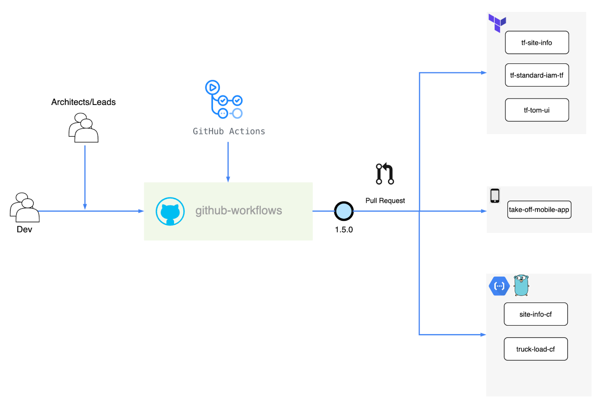

* This repo stores all the github workflows for CI/CD pipelines in TakeOff.
* For pipeline automation we are using the Github Workflows as they come integrated with Github & has no dependency on external tools & in order to streamline the management of the Github workflows we are using a centralised approach.
* The workflows are grouped by platform/language.
  * E.g. Terraform folder contains all the workflows for terraform deployments. 
  * Config drives the shipment of workflows to respective repos.
* The recommended centralised approach is shown in the following diagram :

## Config
Sample config file :

        terraform:
          version: 1.0.1
          destination_base_branch: master
          repo:
            - tf-action-test

## How to add new workflows?
* Make a directory for the platform inside the root folder.
  * eg: terraform
* Copy the workflow file to the platform directory.
  * eg: terraform-deploy-dev.yml
* Make sure that the config file for the platform is present inside the configs folder.
  * eg: terraform.yml

## How workflows are shipped to repos?
* A new tag will be created on push to master.
* We can manually trigger the workflow to ship actions to a single or multiple repos.
  * Input to this workflow will be the tag which was created on merge to master
    * The workflow will only accept a tag as an input, it will fail if a branch is given in the input. 
* This action will create a PR for the repositories present in the config file. eg: 
  * repo:
      - tf-action-test
## How to add new platform?
* Create a new repository in the root directory
  * eg : go
* Create a config file for that platform in Configs folder
  * eg: go.yml
* Update the name of the source folder from which the actions will be copied in the workflow.
  * eg: source_folder: {source_folder_name}/*.yml
* Create a new workflow in .github/workflows to ship the actions to the repos present for the new platform.
  * eg: deploy-go-workflow.yml

## ENV
* API_TOKEN_GITHUB: You must create a personal access token in you account. Follow the link:
- [Personal access token](https://docs.github.com/en/free-pro-team@latest/github/authenticating-to-github/creating-a-personal-access-token)

> You must select the scopes: 'repo = Full control of private repositories', 'admin:org = read:org' and 'write:discussion = Read:discussion';
